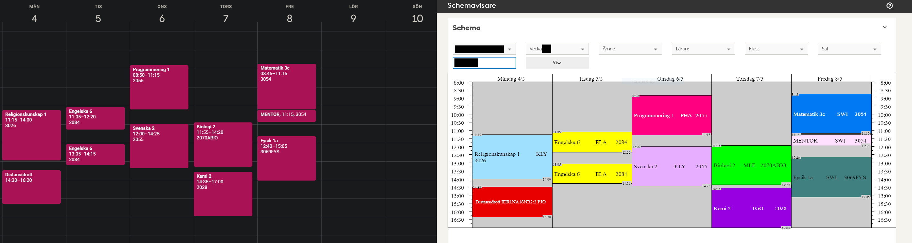

# Schedule Migrater
A tool for copying schedules from _Stockholm Stad's Skola24-page_ to _Google Calendar_.

Dependencies:
* Python environment with packages listed in requirements.txt
* Selenium webdriver, chrome in working directory (scraper.py)
* Google API client secret in working directory (google.py)
